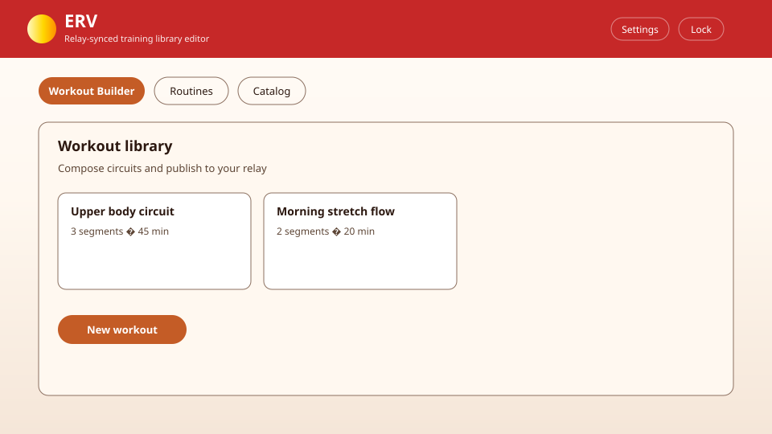

# ERV Web Companion

## Documentation

- [ERV project repository](https://github.com/samcornwell/EnergyRadianceVitality) — source code, issue tracker, and architecture notes for the Android app and this web companion.

## What you get on StartOS

ERV exposes a **Web UI** interface — a browser-based desk for the same health data your Android app uses. Edit exercise catalogs, build weight/stretch/cardio routines, and compose workout circuits, then publish everything to your Nostr relay as encrypted events. Your phone picks up changes after a normal ERV sync.

If **Haven** is installed on this server, ERV detects it and pre-fills the correct relay URL during setup. Haven is recommended because it also provides Blossom media storage for future ERV image backup features. You can still use any compatible external relay URL manually.

## Getting set up

1. Optionally install **Haven** on the same StartOS server (recommended for local relay sync and future media backup).
2. Open the **Web UI** interface from this service page.
3. On first launch, complete **Setup** with the same **nsec** and **relay URL** you use in the Android ERV app.
4. Unlock the session when prompted — your key stays encrypted in the browser; the server never stores your nsec.

## Using ERV

### Web interface

The Web UI opens to setup or unlock, then the main shell with tabs for **Catalog**, **Routines** (Weight / Stretch / Cardio), **Workouts**, and **Settings**.

| Tab | Use it to |
| --- | --- |
| **Catalog** | Browse and edit weight exercises, stretches, and cardio activities (`erv/catalog/*` on your relay). |
| **Routines** | Create, edit, and publish weight, stretch, or cardio routines. |
| **Workouts** | Compose circuit and superset sessions; publish to `erv/workouts/library`. |
| **Settings** | Relay connection, session lock, and import/export helpers. |

After publishing, open **ERV on your phone → sync**, then check the matching silo (for example **Weight Training → Routines** or **Training → Workouts**).

### Quick verification

1. Create a weight routine with two exercises — confirm the success toast shows a Nostr event id.
2. On Android (same nsec + relay): sync → **Weight Training → Routines** — the routine should appear.
3. Repeat for a stretch or cardio routine if you use those silos.
